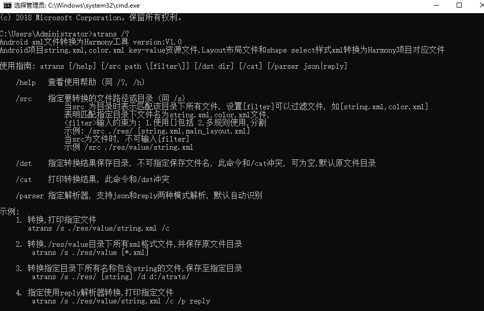

# Atrans

### 它是什么

Atrans(Android xml translate) Android项目layout drawable resources xml资源转Harmony对应json 或xml资源文件

### 如何配置使用
1. 下载 [atrans.zip](https://github.com/yuxiangxin/Atrans/raw/master/extend/atrans.zip), 解压缩至任意目录
2. 新建环境变量, 变量名为**atranspath** ,变量值为改目录,再添加 **;%atranspath%** 到path变量中
```path
atranspath=save_path\atrans
path=%atranspath%;
```
       
3. 打开命令行cmd窗口, 键入 trans /?, 如提示使用使用帮助指南则表示配置成功, 否则需要检查变量配置是否正确
   

### 解析器配置文件介绍


* reply转换器    
  **reply_parse_config.xml**字段说明

```xml

<rule>
    <!--  命名空间name为android的将被替换为ohos -->
    <reply name="namespacePrefix" src="android">ohos</reply>
  <!--  命名空间uri部分为heep://xxxd的将被替换为http://schemas.huawei.com/res/ohos -->
    <reply name="namespaceURI" src="http://schemas.android.com/apk/res/android" mode="word_all">
        http://schemas.huawei.com/res/ohos
    </reply>
    <!-- ElementName为View的将被替换为Component -->
    <reply name="elementName" src="View" mode="word_all">Component</reply>
    <reply name="attributeName" src="gravity" mode="word_all">alignment</reply>
    <!-- ElementName包含dp的部分将被替换为vp,且不区分大小写 -->
    <reply name="attributeValue" src="dp" ignoreCase="true" mode="contains_match">vp</reply>
    ...
</rule>
```

name属性值对应xml元素内容


**mode字段意义**

| 属性值 | 属性意义 |
| :-----:| :----: |
| word_all | 单词对比, 完整替换 |
| contains_match | 包含对比, 包含替换 |
| contains_all | 包含对比, 完整替换 |

* json转换器    
  json_parse_config.xml
 ```xml
<parser>
  <!--  ElementName为dimen的将解析为json对象, 在嵌套key为"float"的对象中输出  -->
  <parse name="dimen" jsonKey="float" type="object">
    <!--  属性值dp的将被替换vp, 且不区分大小写  -->
      <reply name="attributeValue" src="dp" ignoreCase="true" mode="contains_match">vp</reply>
  </parse>
  <!--  ElementName为array的将解析为json数组, 在嵌套key为"strarray"的对象中输出  -->
  <parse name="array" jsonKey="strarray" type="array" />
</parser>
 ```

*translate作为独立的功能模块, 你可以基于此library实现idea插件*

### License

Apache 2.0, See the [LICENSE](./LICENSE) file for details.
