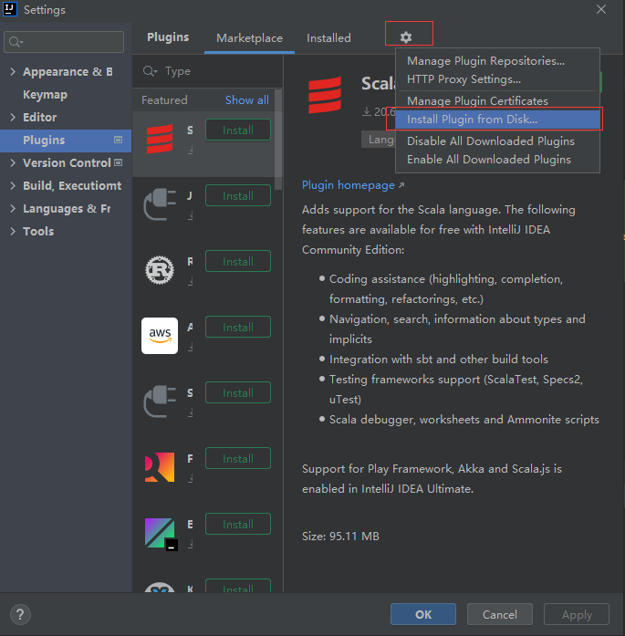

# Atrans

### 它是什么

Atrans(Android xml translate) Android项目layout drawable resources xml资源转Harmony对应json 或xml资源文件

### 下载安装
1. 下载 [Atrans-Plugin.zip](https://github.com/yuxiangxin/Atrans/raw/master/extend/Atrans-Plugin.zip) 保存本地,勿解压缩
2.  打开Idea插件安装页面, 选择从本地安装, 再重启IDEA    
File->Settings->Plugin->右上管理图标->Install plugin from Disk->选择刚下载的插件zip文件, 应用再重启.
    
3. 鼠标右击要转换的xml文件, 弹出菜单, 选择[Atrans to Harmony]将转换结果复制到粘贴板

### License

Apache 2.0, See the [LICENSE](./LICENSE) file for details.
